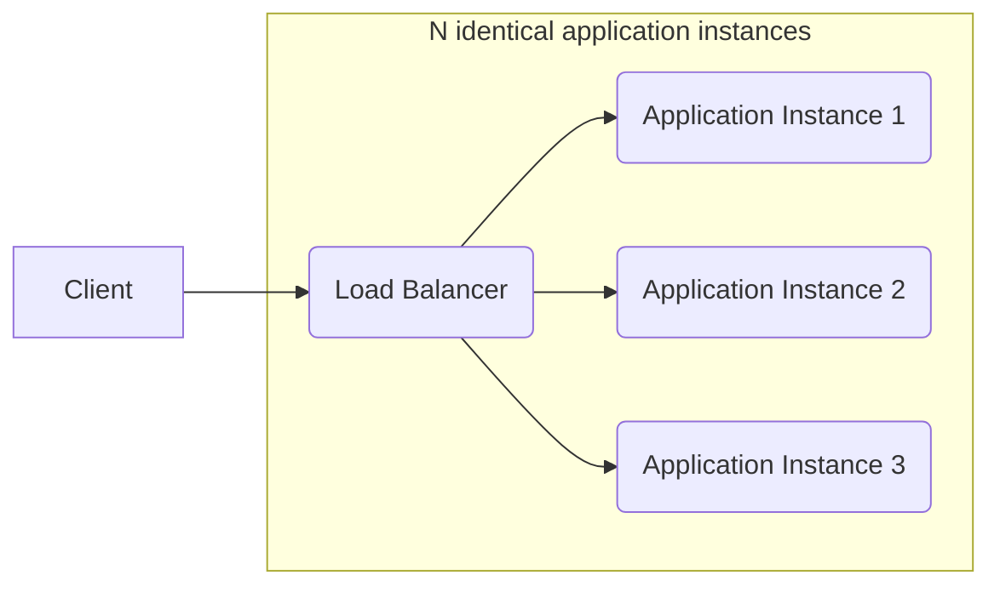
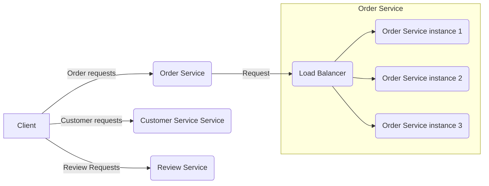

# Escaping the monolithic hell

The **monolithic architecture** pattern structures the application as a single deployable unit.

The **Microservices architecture** pattern decomposes a system into a set of independent deployable services, each with its own database.

The monolithic architecture is a good choice for simple applications, but microservice architecture is usually a better choice for lange, complex applications.

The microservice architecture accelerates the velocity of software development by enabling small, autonomous teams to work in parallel.

The microservice architecture isn't a silver bullet since there are significant drawbacks, including complexity and it is not suitable for a brand new application that has to be ready to the market.

The **Microservice architecture pattern language** is a collection of patterns that help you architect an application using the microservice achitecture. It helps you decide whether to use the microservice architecture, and if you pick the microsevice achitecture, the pattern language helps you apply it effectively. 
A commonly used pattern structure includes three especially valuable sections:
- Forces: describe the issues that you must address when solving a problem in a given context;
- Resulting context: consequences of applying the pattern and consists of:
  -  Benefits;
  -  Drawbacks;
  -  Issues.
- Related patterns: relationships between the pattern and other pattens and are:
  - Predecessor: a pattern that motivates the need for this pattern;
  - Successor: a pattern that solves an issue that has been introduced by this pattern;
  - Alternative: a pattern that produces an alternative solution to this pattern;
  - Generalization: a patter that is a general solution to a problem;
  - Specialization: a specialized for of a particular pattern.

**Microservices patterns** can be divided in:
- Infrastructure patterns: these solve problems that are mostly infrastructure issues outside of development;
- Application infrastructure: there are for infrastrucutre issues that also impact development;
- Application patterns: these solve problems faced by developers.

You need more than just the microservice architecture to accelerate software delivery. Successful software development also requires DevOps and small, autonomous teams.

> The communication overhead of a team of size *N* is *O(N^2)*.

Don't forget about the human side of adopting microservices: you need to consider employees' emotion in order to successfully transition to a microservice architecture.

## Scaling differences

Scaling multiple instances of the same monolith

Scaling different functions of an application

## Microservice Architecture is not SOA

|                             | SOA                                                                       | Microservices                                                                                                      |
|-----------------------------|---------------------------------------------------------------------------|--------------------------------------------------------------------------------------------------------------------|
| Inter-service communication | Smart pipes, such as Enterprice service bus using protocols such as SOAP. | Dumb pipes such as message broker, or direct service-to-service communication using protocols such as REST or gRPC |
| Data                        | Global data model and shared data-bases                                   | Data model and database per service                                                                                |
| Typical Service             | Larger monolithic application                                             | Smaller service                                                                                                    |